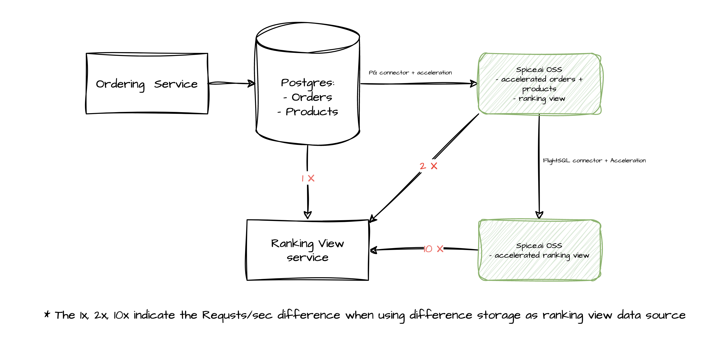

# Local Materialization and Acceleration CQRS Sample

Use Spice.ai to simplify the process of building a high-performance [Command Query Responsibility Segregation (CQRS)](https://microservices.io/patterns/data/cqrs.html) application with local materialization and acceleration.

In this sample, we use one Spice runtime to replicate and accelerate data from Postgres, which improves the query throughput by 2X (See performance benchmarks below).
Then we use another Spice runtime to show how runtimes can be chained together to accelerate and materialize views on top of the previous Spice runtime. Which improves the query throughput by further 5X.

The sample application has:

1. An `/orders` API to generate a random order with a random count
2. A single PostgreSQL database to receive orders and store products.
3. Three `/ranking` APIs to show the top 5 selling products:

- `/ranking` - fetch data from postgres
- `/ranking-accelerated` - fetch data from Spice runtime without materialized ranking view, it pulls data from postgres into edge acceleration to improve query performance
- `/ranking-materialized` - fetch data from Spice runtime with materialized ranking view, it pulls data from ranking view from the previous Spice runtime and accelerates it locally



## How to run

Clone this samples repo locally:
```bash
git clone https://github.com/spiceai/samples.git
cd samples/acceleration
```

`make`

then call the rankings API
`curl localhost:9999/ranking`

## Performance benchmark using oha

Install [oha](https://docs.rs/crate/oha/latest)

Stats:

| Scenario                                                  | Success Rate   | Total Time (secs)   | Slowest (secs)    | Fastest (secs)    | Average (secs)    | Requests/sec    | Total Data   | Size/request    | Size/sec   |
| ----------                                                | -------------- | ------------------- | ----------------- | ----------------- | ----------------- | --------------- | ------------ | --------------- | ---------- |
| From Postgres                                             | 99.82%         | 47.4194             | 1.1856            | 0.0003            | 0.2364            | 421.7687        | 2.70 MiB     | 14              | 58.41 KiB  |
| Spice.ai OSS with acceleration, without materialized view | 100.00%        | 22.3230             | 0.2257            | 0.0058            | 0.1115            | 895.9356        | 2.71 MiB     | 14              | 124.24 KiB |
| Spice.ai OSS with acceleration, with materialized view    | 100.00%        | 4.4439              | 0.0628            | 0.0010            | 0.0222            | 4500.5780       | 2.71 MiB     | 14              | 624.10 KiB |

See more details below.

### From Postgres

```bash
…/sample-1 main ❯ oha -n20000 -c100 'http://localhost:9999/ranking'
Summary:
  Success rate:	100.00%
  Total:	50.0597 secs
  Slowest:	1.3095 secs
  Fastest:	0.0004 secs
  Average:	0.2493 secs
  Requests/sec:	399.5230

  Total data:	2.70 MiB
  Size/request:	14
  Size/sec:	55.23 KiB

Response time histogram:
  0.000 [1]    |
  0.131 [7903] |■■■■■■■■■■■■■■■■■■■■■■■■■■■■■■■■
  0.262 [1743] |■■■■■■■
  0.393 [5149] |■■■■■■■■■■■■■■■■■■■■
  0.524 [3935] |■■■■■■■■■■■■■■■
  0.655 [589]  |■■
  0.786 [344]  |■
  0.917 [228]  |
  1.048 [62]   |
  1.179 [26]   |
  1.309 [20]   |

Response time distribution:
  10.00% in 0.0045 secs
  25.00% in 0.0811 secs
  50.00% in 0.2872 secs
  75.00% in 0.3949 secs
  90.00% in 0.4966 secs
  95.00% in 0.5982 secs
  99.00% in 0.8820 secs
  99.90% in 1.1877 secs
  99.99% in 1.2986 secs

Details (average, fastest, slowest):
  DNS+dialup:	0.0022 secs, 0.0009 secs, 0.0110 secs
  DNS-lookup:	0.0001 secs, 0.0000 secs, 0.0008 secs

Status code distribution:
  [200] 19917 responses
  [500] 83 responses
```

### From Spice.ai OSS with acceleration, without materialized view

```bash
…/sample-1 main 47s ❯ oha -n20000 -c100 'http://localhost:9999/ranking-accelerated'
Summary:
  Success rate:	100.00%
  Total:	3.5200 secs
  Slowest:	0.0783 secs
  Fastest:	0.0010 secs
  Average:	0.0176 secs
  Requests/sec:	5681.8874

  Total data:	2.71 MiB
  Size/request:	14
  Size/sec:	787.79 KiB

Response time histogram:
  0.001 [1]    |
  0.009 [1598] |■■■■■
  0.016 [7334] |■■■■■■■■■■■■■■■■■■■■■■■■■■
  0.024 [8796] |■■■■■■■■■■■■■■■■■■■■■■■■■■■■■■■■
  0.032 [1783] |■■■■■■
  0.040 [169]  |
  0.047 [71]   |
  0.055 [96]   |
  0.063 [61]   |
  0.071 [43]   |
  0.078 [48]   |

Response time distribution:
  10.00% in 0.0093 secs
  25.00% in 0.0130 secs
  50.00% in 0.0172 secs
  75.00% in 0.0210 secs
  90.00% in 0.0246 secs
  95.00% in 0.0272 secs
  99.00% in 0.0504 secs
  99.90% in 0.0747 secs
  99.99% in 0.0782 secs


Details (average, fastest, slowest):
  DNS+dialup:	0.0039 secs, 0.0024 secs, 0.0105 secs
  DNS-lookup:	0.0000 secs, 0.0000 secs, 0.0005 secs

Status code distribution:
  [200] 20000 responses
```

### From Spice.ai OSS with acceleration, with materialized view

```bash
…/sample-1 main ❯ oha -n20000 -c100 'http://localhost:9999/ranking-materialized'
Summary:
  Success rate:	100.00%
  Total:	2.6181 secs
  Slowest:	0.0707 secs
  Fastest:	0.0006 secs
  Average:	0.0131 secs
  Requests/sec:	7639.1770

  Total data:	2.71 MiB
  Size/request:	14
  Size/sec:	1.03 MiB

Response time histogram:
  0.001 [1]    |
  0.008 [2800] |■■■■■■■■■
  0.015 [9890] |■■■■■■■■■■■■■■■■■■■■■■■■■■■■■■■■
  0.022 [6695] |■■■■■■■■■■■■■■■■■■■■■
  0.029 [494]  |■
  0.036 [20]   |
  0.043 [9]    |
  0.050 [15]   |
  0.057 [38]   |
  0.064 [15]   |
  0.071 [23]   |

Response time distribution:
  10.00% in 0.0068 secs
  25.00% in 0.0096 secs
  50.00% in 0.0130 secs
  75.00% in 0.0161 secs
  90.00% in 0.0186 secs
  95.00% in 0.0204 secs
  99.00% in 0.0245 secs
  99.90% in 0.0642 secs
  99.99% in 0.0670 secs


Details (average, fastest, slowest):
  DNS+dialup:	0.0039 secs, 0.0028 secs, 0.0042 secs
  DNS-lookup:	0.0001 secs, 0.0000 secs, 0.0006 secs

Status code distribution:
  [200] 20000 responses
```

## Clean up

To stop and remove the Docker containers/volumes that were created, run:

`make clean`
