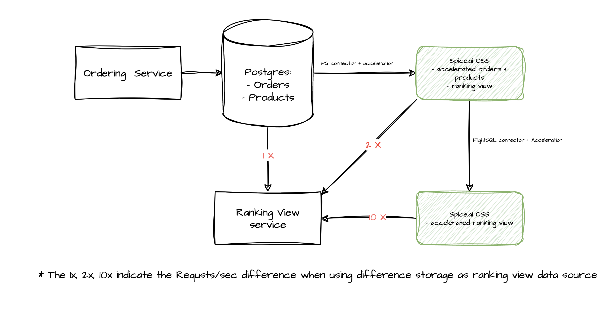

# Local Materialization and Acceleration CQRS Sample

Use Spice.ai to simplify the process of building a high-performance [Command Query Responsibility Segregation (CQRS)](https://microservices.io/patterns/data/cqrs.html) application with local materialization and acceleration.

In this sample, we use one Spice runtime to replicate and accelerate data from Postgres, which improves the query throughput by 2X (See performance benchmarks below).
Then we use another Spice runtime to show how runtimes can be chained together to accelerate and materialize views on top of the previous Spice runtime. Which improves the query throughput by further 5X.

The sample application has:

1. An `/orders` API to generate a random order with a random count
2. A single PostgreSQL database to receive orders and store products.
3. Three `/ranking` APIs to show the top 5 selling products:

- `/ranking` - fetch data from postgres
- `/ranking-accelerated` - fetch data from Spice runtime without materialized ranking view, it pulls data from postgres into edge acceleration to improve query performance
- `/ranking-materialized` - fetch data from Spice runtime with materialized ranking view, it pulls data from ranking view from the previous Spice runtime and accelerates it locally



## How to run

Clone this samples repo locally:
```bash
git clone https://github.com/spiceai/samples.git
cd samples/acceleration
```

`make`

then call the rankings API
`curl localhost:9999/ranking`

## Performance benchmark using oha

Install [oha](https://docs.rs/crate/oha/latest)

Stats:

| Scenario                                                  | Success Rate   | Total Time (secs)   | Slowest (secs)    | Fastest (secs)    | Average (secs)    | Requests/sec    | Total Data   | Size/request    | Size/sec   |
| ----------                                                | -------------- | ------------------- | ----------------- | ----------------- | ----------------- | --------------- | ------------ | --------------- | ---------- |
| From Postgres                                             | 99.82%         | 47.4194             | 1.1856            | 0.0003            | 0.2364            | 421.7687        | 2.70 MiB     | 14              | 58.41 KiB  |
| Spice.ai OSS with acceleration, without materialized view | 100.00%        | 22.3230             | 0.2257            | 0.0058            | 0.1115            | 895.9356        | 2.71 MiB     | 14              | 124.24 KiB |
| Spice.ai OSS with acceleration, with materialized view    | 100.00%        | 4.4439              | 0.0628            | 0.0010            | 0.0222            | 4500.5780       | 2.71 MiB     | 14              | 624.10 KiB |

See more details below.

### From Postgres

```bash
…/sample-1 main ❯ oha -n20000 -c100 'http://localhost:9999/ranking'
Summary:
  Success rate:	100.00%
  Total:	32.4308 secs
  Slowest:	2.2032 secs
  Fastest:	0.0003 secs
  Average:	0.1618 secs
  Requests/sec:	616.6980

  Total data:	2.70 MiB
  Size/request:	14
  Size/sec:	85.37 KiB

Response time histogram:
  0.000 [1]     |
  0.221 [15519] |■■■■■■■■■■■■■■■■■■■■■■■■■■■■■■■■
  0.441 [3654]  |■■■■■■■
  0.661 [602]   |■
  0.881 [152]   |
  1.102 [53]    |
  1.322 [12]    |
  1.542 [3]     |
  1.763 [2]     |
  1.983 [1]     |
  2.203 [1]     |

Response time distribution:
  10.00% in 0.0027 secs
  25.00% in 0.0150 secs
  50.00% in 0.1222 secs
  75.00% in 0.2129 secs
  90.00% in 0.3096 secs
  95.00% in 0.4052 secs
  99.00% in 0.6864 secs
  99.90% in 1.1010 secs
  99.99% in 1.6975 secs


Details (average, fastest, slowest):
  DNS+dialup:	0.0020 secs, 0.0011 secs, 0.0024 secs
  DNS-lookup:	0.0000 secs, 0.0000 secs, 0.0002 secs

Status code distribution:
  [200] 19953 responses
  [500] 47 responses
```

### From Spice.ai OSS with acceleration, without materialized view

```bash
…/sample-1 main 47s ❯ oha -n20000 -c100 'http://localhost:9999/ranking-accelerated'
Summary:
  Success rate:	100.00%
  Total:	3.1118 secs
  Slowest:	0.2380 secs
  Fastest:	0.0008 secs
  Average:	0.0155 secs
  Requests/sec:	6427.1902

  Total data:	2.71 MiB
  Size/request:	14
  Size/sec:	891.27 KiB

Response time histogram:
  0.001 [1]     |
  0.025 [19330] |■■■■■■■■■■■■■■■■■■■■■■■■■■■■■■■■
  0.048 [585]   |
  0.072 [33]    |
  0.096 [4]     |
  0.119 [0]     |
  0.143 [0]     |
  0.167 [0]     |
  0.191 [0]     |
  0.214 [0]     |
  0.238 [47]    |

Response time distribution:
  10.00% in 0.0084 secs
  25.00% in 0.0114 secs
  50.00% in 0.0151 secs
  75.00% in 0.0182 secs
  90.00% in 0.0209 secs
  95.00% in 0.0231 secs
  99.00% in 0.0335 secs
  99.90% in 0.2351 secs
  99.99% in 0.2370 secs


Details (average, fastest, slowest):
  DNS+dialup:	0.0019 secs, 0.0008 secs, 0.0022 secs
  DNS-lookup:	0.0000 secs, 0.0000 secs, 0.0002 secs

Status code distribution:
  [200] 20000 responses
```

### From Spice.ai OSS with acceleration, with materialized view

```bash
…/sample-1 main ❯ oha -n20000 -c100 'http://localhost:9999/ranking-materialized'
ummary:
  Success rate:	100.00%
  Total:	2.1384 secs
  Slowest:	0.2289 secs
  Fastest:	0.0005 secs
  Average:	0.0107 secs
  Requests/sec:	9352.6076

  Total data:	2.71 MiB
  Size/request:	14
  Size/sec:	1.27 MiB

Response time histogram:
  0.001 [1]     |
  0.023 [19811] |■■■■■■■■■■■■■■■■■■■■■■■■■■■■■■■■
  0.046 [115]   |
  0.069 [0]     |
  0.092 [0]     |
  0.115 [0]     |
  0.138 [0]     |
  0.160 [0]     |
  0.183 [0]     |
  0.206 [5]     |
  0.229 [68]    |

Response time distribution:
  10.00% in 0.0048 secs
  25.00% in 0.0070 secs
  50.00% in 0.0098 secs
  75.00% in 0.0124 secs
  90.00% in 0.0151 secs
  95.00% in 0.0169 secs
  99.00% in 0.0225 secs
  99.90% in 0.2168 secs
  99.99% in 0.2288 secs


Details (average, fastest, slowest):
  DNS+dialup:	0.0021 secs, 0.0011 secs, 0.0028 secs
  DNS-lookup:	0.0000 secs, 0.0000 secs, 0.0006 secs

Status code distribution:
  [200] 20000 responses
```

## Clean up

To stop and remove the Docker containers/volumes that were created, run:

`make clean`
