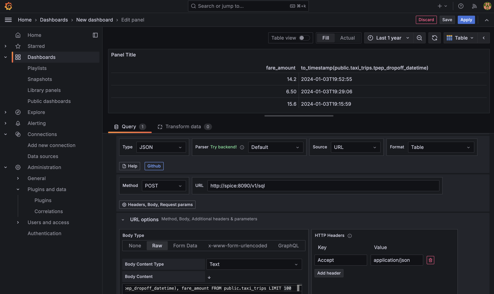

# Adding Spice as a Grafana datasource

## Context

This sample will show how to configure a Grafana dashboard to use Spice as the data source using [FlightSQL](https://grafana.com/grafana/plugins/influxdata-flightsql-datasource/) and [Infinity](https://grafana.com/docs/plugins/yesoreyeram-infinity-datasource/latest/) plugins.

## Pre-requisites

This sample requires [Docker](https://www.docker.com/) and [Docker Compose](https://docs.docker.com/compose/) to be installed.

## Running the sample

Clone the `spiceai/samples` repository and navigate to the `grafana-datasource` directory:

```bash
git clone https://github.com/spiceai/samples.git
cd samples/grafana-datasource
```

Run the following command to start the components in the Docker Compose file:

`make`

This will start the Spice runtime and Grafana server. The Spice runtime will load two datasets based on the parquet file in S3.

## Setup with FlightSQL Grafana plugin

1. Open Grafana in your browser at [http://localhost:3000](http://localhost:3000).
1. Log in with the default credentials `admin`/`admin`, skip the password change prompt.


1. Navigate to Administation -> Plugins and data -> Plugins.
1. Select "State: All", and search for "FlightSQL".


1. Click on the "Install" button to install the plugin, and then "Add new data source".


1. Fill in the following fields:
   - Name: `Spice`
   - Host:Port: `spice:50051`
   - Auth Type: `None`


1. Click on "Save & Test" to save the data source, then click on "Build a dashboard".
1. Click on "Add visualization" and select "Spice" from the list of data sources.


1. Switch to SQL query editor and paste the following query. Then select `Zoom to data`

   ```sql
   SELECT to_timestamp(tpep_dropoff_datetime), fare_amount FROM public.taxi_trips LIMIT 100
   ```


### Setup with Infinity Grafana plugin

Follow steps 1-3 from the previous section.

1. Select "State: All", and search for "Infinity". Install and click on "Add new data source".


1. Leave the default values and click on "Save & Test".


1. Click on "Build a dashboard" and add a new visualization. Select "Infinity" from the list of data sources.
1. Change "Method" to "POST" and "URL" to `http://spice:8090/v1/sql`. Add SQL query in body, using "Raw" mode:

    ```sql
    SELECT to_timestamp(tpep_dropoff_datetime), fare_amount FROM public.taxi_trips LIMIT 100
    ```

   Add the header `Accept: application/json` as well.



## Clean up

To stop and remove the Docker containers/volumes that were created, run:

`make clean`
